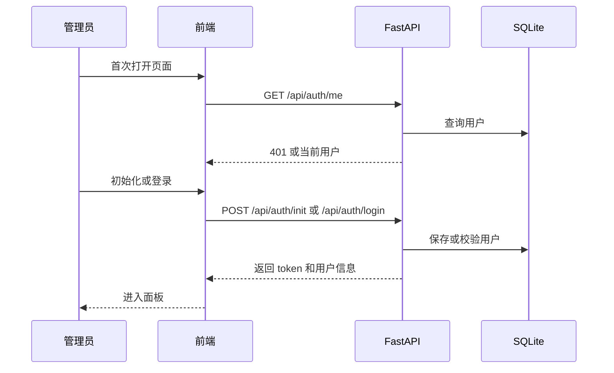
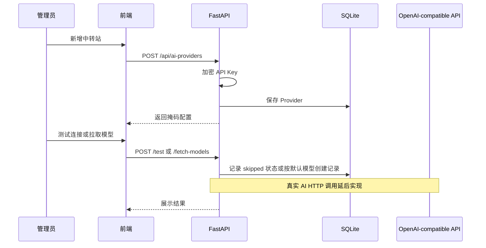
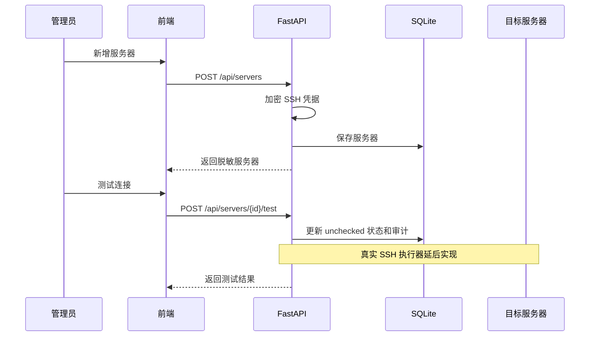

# Milestone 1：基础面板架构设计

## 1. 总体设计

第一阶段在现有 FastAPI + React + SQLite 基础上补齐管理后台主链路。后端增加认证、凭据加密、AI Provider 管理、服务器管理、连接测试占位、快照记录占位和基础审计。前端从静态面板升级为真实数据驱动的管理后台。

Web SSH、AI 助手、真实 SSH 执行器、真实 AI 连接测试和部署任务暂不进入本阶段，但数据模型和接口保留扩展点。当前 `/test` 和 `/snapshot` 接口返回明确的 `unchecked/skipped` 状态，不伪造真实连接结果。

## 2. 模块影响

### 后端

- `backend/app/api/routes.py`：扩展 Auth、AI Provider、AI Model、Server 路由。
- `backend/app/schemas/`：新增认证、AI Provider、Server、Snapshot 请求响应模型。
- `backend/app/core/`：新增凭据加密、密码哈希、token 工具。
- `backend/app/db/`：补字段、新增 `ServerSnapshot`，使用 `AuditLog`。
- `backend/app/services/`：本阶段暂未拆分服务层，后续应从 `routes.py` 提取认证、AI、服务器、审计服务，降低路由文件复杂度。
- `backend/tests/`：新增认证、AI Provider、Server、SSH mock、快照测试。

### 前端

- `frontend/src/App.tsx`：接入认证、服务器列表/新增、AI Provider 新增/列表、命令检查和部署计划校验。
- `frontend/src/App.test.tsx`：覆盖初始化、服务器新增、AI Provider 新增、菜单切换、命令检查、部署计划校验。
- 后续应拆分 `api.ts`、`types.ts` 和页面组件，当前为控制改动面仍集中在 `App.tsx`。

### 部署

- `Dockerfile`：建议把 `pip install .` 放到复制前端静态资源之前，减少前端变更导致后端依赖重装。
- `docker-compose.yml`：保留用户本地端口改动，不擅自覆盖。

## 3. 认证流

## 4. AI Provider 流

## 5. 服务器管理流

## 6. 快照采集

设计目标是通过 SSH 执行只读命令采集：

- `uname -a`
- `/etc/os-release`
- `nproc`
- `free -b`
- `df -B1 /`
- `hostname -I`

当前实现先落库 `ServerSnapshot`，状态为 `skipped`，提示需要后续真实 SSH executor。真实命令执行、输出解析和 mock AsyncSSH 测试放入下一阶段。

## 7. 安全约束

- 所有凭据必须加密保存。
- API 响应不返回 `encrypted_password`、`encrypted_private_key`、`encrypted_api_key`。
- 密钥字段返回 `has_api_key`、`api_key_mask`、`has_password`、`has_private_key`。
- 未登录不能访问 AI Provider 和 Server 接口。
- SSH 测试和快照命令只允许后端内置只读命令，不接受用户任意命令。
- 当前 token 为简单 HMAC Bearer token，尚无过期时间；生产长期使用前应升级为带过期时间的 session 或 JWT。

## 8. 回滚方案

- 代码回滚：还原本阶段提交。
- 数据回滚：SQLite 可备份 `/app/data/ai_agent_ssh.db`。
- 配置回滚：恢复上一版 `.env` 和 Docker Compose。
- 如果 `CREDENTIAL_SECRET` 变更导致无法解密，需恢复原密钥。
