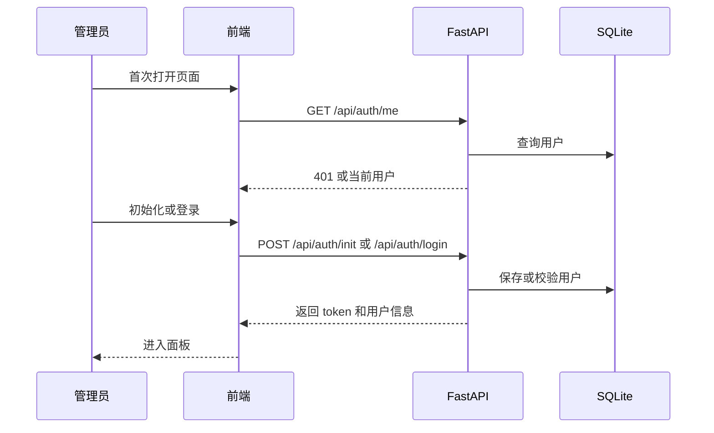
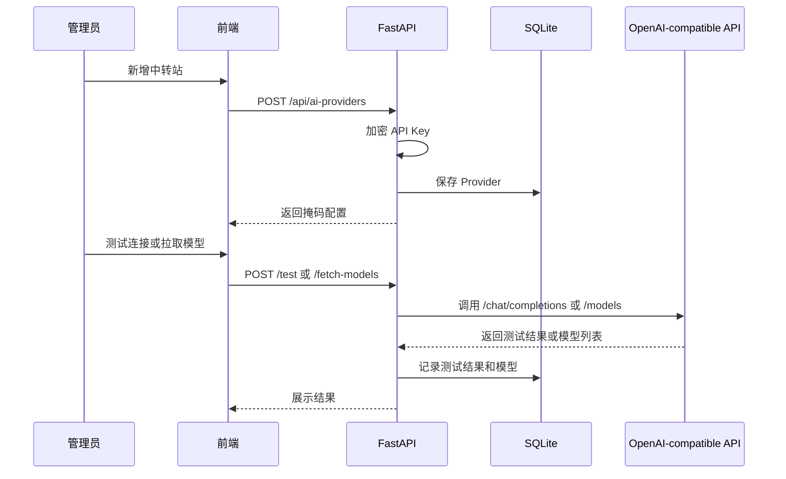
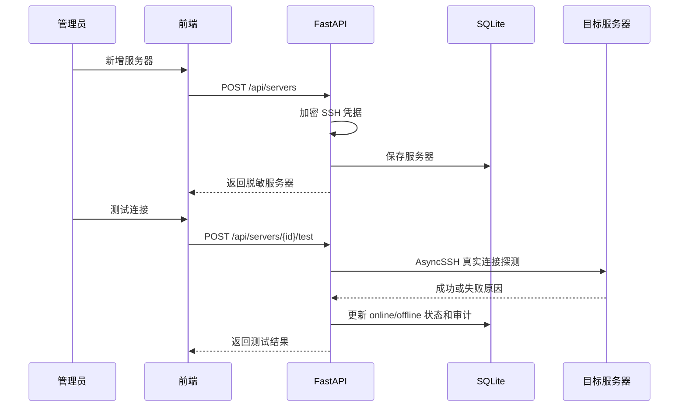
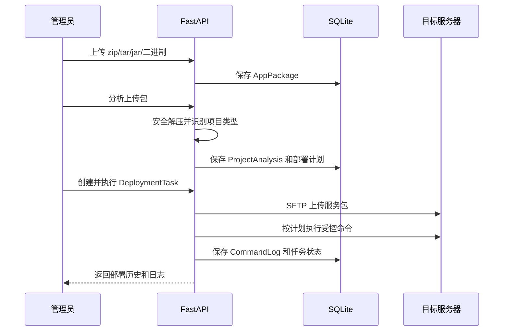
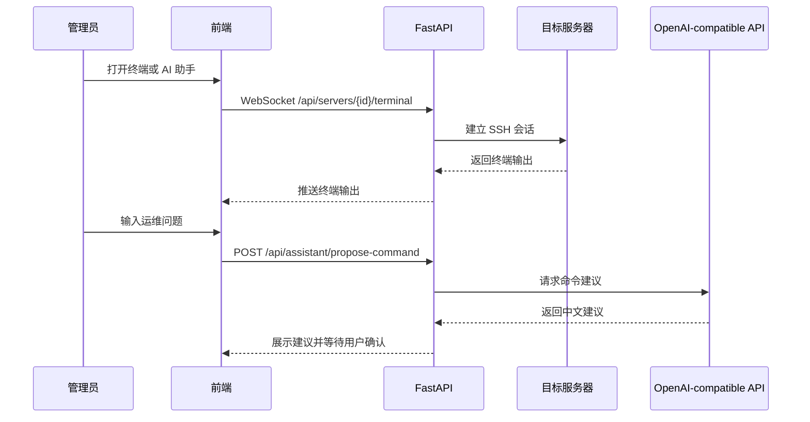

# Milestone 1：基础面板架构设计

## 1. 总体设计

第一阶段在现有 FastAPI + React + SQLite 基础上补齐管理后台主链路。后端增加认证、凭据加密、AI Provider 管理、服务器管理、真实 SSH 连接测试、资源快照采集、受控命令执行、服务包分析、部署计划和部署执行日志。前端从静态面板升级为真实数据驱动的管理后台。

Web SSH 终端和 AI 助手已纳入本阶段闭环；后端不返回静态演示状态，AI Provider 测试、模型拉取、服务器快照、命令执行、终端代理和部署任务均执行真实后端逻辑。

## 2. 模块影响

### 后端

- `backend/app/api/routes.py`：扩展 Auth、AI Provider、AI Model、Server、Command、Package、Analysis、Deployment 路由。
- `backend/app/schemas/`：新增认证、AI Provider、Server、Snapshot 请求响应模型。
- `backend/app/core/`：新增凭据加密、密码哈希、token 工具。
- `backend/app/db/`：补字段，新增 `ServerSnapshot` 资源字段、`AppPackage`、`ProjectAnalysis`、`DeploymentTask`、`CommandLog`，继续使用 `AuditLog`。
- `backend/app/services/`：新增 AI Gateway、SSH 命令执行、服务器快照解析、项目分析服务。
- `backend/tests/`：新增认证、AI Provider、Server、AI Gateway、快照、项目分析、命令和部署测试。

### 前端

- `frontend/src/App.tsx`：接入认证、服务器管理、Web 终端、AI Provider、AI 助手、服务包部署、命令检查和部署历史。
- `frontend/src/App.test.tsx`：覆盖初始化、服务器新增和编辑、AI Provider、菜单切换、命令检查、部署计划、服务包和助手交互。
- 当前为控制改动面仍集中在 `App.tsx`，功能稳定后可拆分 `api.ts`、`types.ts` 和页面组件。

### 部署

- `Dockerfile`：建议把 `pip install .` 放到复制前端静态资源之前，减少前端变更导致后端依赖重装。
- `docker-compose.yml`：保留用户本地端口改动，不擅自覆盖。

## 3. 认证流

## 4. AI Provider 流

## 5. 服务器管理流

## 6. 快照采集

设计目标是通过 SSH 执行只读命令采集：

- `uname -a`
- `/etc/os-release`
- `nproc`
- `free -b`
- `df -B1 /`
- `hostname -I`

当前实现通过 SSH 执行内置只读命令，解析 `OS`、`KERNEL`、`CPU_CORES`、`CPU_USAGE`、`MEMORY_*`、`DISK_*`、`IP_ADDRESSES` 并落库到 `ServerSnapshot`。采集失败时记录中文失败原因，并将服务器状态标记为 `offline`。

## 7. 服务包分析与部署执行

- 支持识别 Docker、Java、Node.js、Python、Go、静态站点和未知项目。
- 部署计划中的每个命令复用危险命令校验。
- 压缩包解压会拒绝 `../` 等路径穿越内容。
- 关联服务包的部署任务会先上传服务包，再执行计划步骤。

## 8. 安全约束

- 所有凭据必须加密保存。
- API 响应不返回 `encrypted_password`、`encrypted_private_key`、`encrypted_api_key`。
- 密钥字段返回 `has_api_key`、`api_key_mask`、`has_password`、`has_private_key`。
- 未登录不能访问 AI Provider 和 Server 接口。
- SSH 测试和快照命令只允许后端内置只读命令。
- 用户命令和部署计划命令执行前必须通过危险命令校验，并记录 `CommandLog`。
- 服务包解压必须校验目标路径，防止压缩包路径穿越。
- 当前 token 为简单 HMAC Bearer token，尚无过期时间；生产长期使用前应升级为带过期时间的 session 或 JWT。

## 9. Web 终端与 AI 助手

- 终端代理复用已保存的 SSH 凭据，不在前端暴露密码或私钥。
- AI 助手只生成建议和总结，不自动绕过命令安全检查。
- 用户执行建议命令时仍走受控命令接口，并记录命令日志。

## 10. 回滚方案

- 代码回滚：还原本阶段提交。
- 数据回滚：SQLite 可备份 `/app/data/ai_agent_ssh.db`。
- 配置回滚：恢复上一版 `.env` 和 Docker Compose。
- 如果 `CREDENTIAL_SECRET` 变更导致无法解密，需恢复原密钥。
