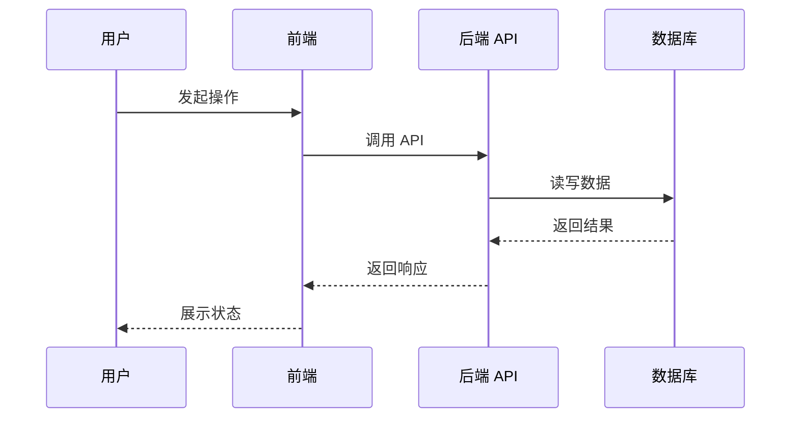

# <需求名称> 架构设计

## 1. 总体设计

说明需求如何落到当前 FastAPI + React + Docker 架构中。

## 2. 模块影响

### 后端

- `backend/app/api/`：
- `backend/app/schemas/`：
- `backend/app/core/`：
- `backend/app/db/`：

### 前端

- `frontend/src/`：

### 部署

- `Dockerfile`：
- `docker-compose.yml`：

## 3. 数据流

## 4. 状态和错误处理

- loading：
- 成功：
- 失败：
- 重试：

## 5. 安全约束

- 凭据不得明文输出。
- AI 生成命令必须经过后端校验。
- 高危命令必须拦截。

## 6. 回滚方案

- 代码回滚：
- 数据回滚：
- 配置回滚：
